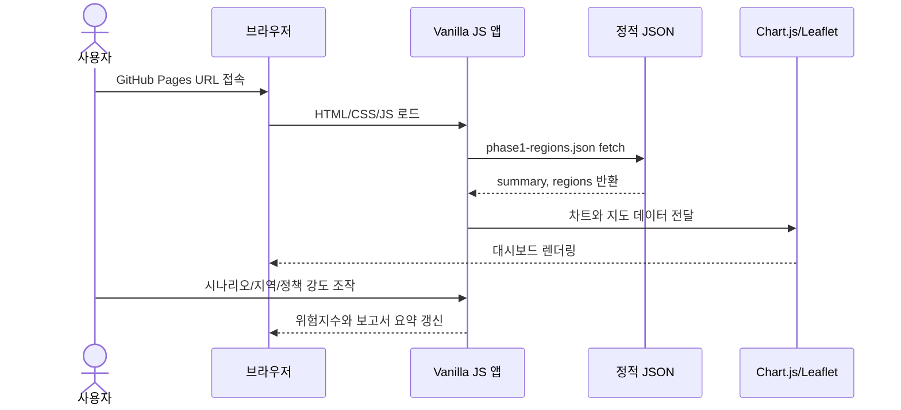

# Korea Regional Imbalance Dashboard

> 소프트웨어공학 과제 **"프로세스에 입각한 바이브코딩의 효과 논술"**을 위한 실증 프로젝트.
> 한국 지역 불균형 데이터를 대시보드로 만들고, 요구사항 분석부터 품질 관리까지의 프로세스 적용 과정을 GitHub에 증빙한다.

[](https://github.com/Bias92/korea-regional-imbalance/actions/workflows/ci.yml)
[](https://github.com/Bias92/korea-regional-imbalance/actions/workflows/pages.yml)
[](https://bias92.github.io/korea-regional-imbalance/)
[](./docs/final-report.pdf)
[](./docs/submission-evidence.md)
[](./manifest.webmanifest)

## Live

| 항목 | 링크 |
|---|---|
| 실행 데모 | [https://bias92.github.io/korea-regional-imbalance/](https://bias92.github.io/korea-regional-imbalance/) |
| 최종 PDF 보고서 | [docs/final-report.pdf](./docs/final-report.pdf) |
| 제출 증빙 인덱스 | [docs/submission-evidence.md](./docs/submission-evidence.md) |
| 최종 체크리스트 | [docs/final-submission-checklist.md](./docs/final-submission-checklist.md) |
| PWA manifest | [manifest.webmanifest](./manifest.webmanifest) |


## 이 프로젝트는 무엇인가

수도권 집중, 인구감소지역, 폐교 수처럼 서로 흩어져 있는 지역 불균형 지표를 한 화면에서 비교하는 정적 웹 대시보드다.
단순히 앱을 만드는 것이 아니라, **AI 보조 개발을 소프트웨어공학 프로세스 안에서 통제했을 때 어떤 효과가 있는지**를 분석하기 위한 과제 산출물이다.

### 사용자가 할 수 있는 일

| 기능 | 설명 |
|---|---|
| 핵심 통계 카드 | 수도권 인구 비중, GRDP 비중, 인구감소지역 수, 폐교 수를 출처와 함께 확인 |
| 시도별 지도 | Leaflet 기반 choropleth 지도에서 위험지수, 인구 증감률, 인구감소지역, 폐교 수 전환 |
| 위험지수 시나리오 | 균형, 인구감소 중심, 소멸위험 중심, 폐교 중심 기준으로 위험지수 재계산 |
| 지역 비교 | 두 시도를 선택해 위험지수, 인구 흐름, 인구감소지역·폐교 수 차이 비교 |
| 정책 대응 시뮬레이터 | 청년·일자리, 생활권 인프라, 폐교 활용 투입 강도를 바꿔 위험 변화 가설 확인 |
| 지역 탐색 | 지역명 검색, 수도권/비수도권 필터, 위험지수·인구감소·폐교 기준 정렬 |
| 폐교 분석 | 폐교 수 전용 차트, 권역 필터, 설명 카드 제공 |
| 보고서 지원 | 보고서 요약 Markdown 다운로드, 캡처 모드, 인쇄 스타일 제공 |
| PWA 설치 | manifest, 앱 아이콘, service worker를 통해 브라우저에서 앱처럼 설치 가능 |

## 앱인가, 웹인가

이 프로젝트는 **웹앱**이다. GitHub Pages에서 실행되는 정적 웹 대시보드이며, 동시에 PWA 설정을 포함해 지원 브라우저에서는 앱처럼 설치할 수 있다.

| 구분 | 상태 |
|---|---|
| 웹 실행 | 가능, GitHub Pages에서 바로 접속 |
| 모바일 브라우저 | 가능, 반응형 레이아웃 |
| PWA 설치 | 가능, manifest와 service worker 제공 |
| 앱스토어 네이티브 앱 | 아님, iOS/Android 패키지로 빌드한 것은 아님 |
| 데스크톱 설치형 앱 | 아님, Electron/Tauri 패키지는 아님 |

Chrome/Edge/Android에서는 주소창 또는 브라우저 메뉴의 설치 기능을 사용할 수 있고, iOS Safari에서는 공유 메뉴의 "홈 화면에 추가"로 앱처럼 배치할 수 있다.

## 과제 요구사항 대응

| 과제 요구 | 이 저장소의 대응 산출물 |
|---|---|
| 바이브코딩으로 만들 SW 선정 | 한국 지역 불균형 대시보드, [설계 결정 기록](./docs/design.md) |
| 바이브코딩 AI 자율 선정 | Claude와 Codex 역할 분담, [AI 활용 로그](./docs/ai-log/) |
| 요구사항 분석 | [docs/requirements.md](./docs/requirements.md) |
| 방법론과 프로세스 | 위험 기반 반복·점진 개발, V-Model식 추적성, ADR, [docs/process.md](./docs/process.md) |
| 시퀀스/프로세스 다이어그램 | [docs/process.md](./docs/process.md)의 Mermaid 다이어그램 |
| 품질 관리 | `npm test`, UI 계약 검증, 제출물 검증, GitHub Actions |
| SW 산출물 캡처 | [데스크톱 캡처](./docs/assets/screenshots/2026-06-02-dashboard-capture.png), [모바일 캡처](./docs/assets/screenshots/2026-06-02-dashboard-mobile.png) |
| 논술 PDF | [docs/final-report.pdf](./docs/final-report.pdf) |
| 지속적 토의 증빙 | 2026-05-18부터 2026-06-03까지의 [날짜별 AI 로그](./docs/ai-log/)와 Git commit history |

## 프로세스 요약

본 프로젝트는 **위험 기반 반복·점진 개발**로 진행했다. 각 Phase는 작은 폭포수처럼 `요구사항 -> 설계 -> 구현 -> 검증 -> 회고`를 거치고, 결과를 다음 Phase에 반영한다.




## 개발 일정

| Phase | 목표 | 결과 |
|---|---|---|
| Phase 1 | 통계 카드 + 막대차트 MVP | 완료 |
| Phase 2 | Leaflet 시도 지도 + 위험지수 | 완료 |
| Phase 3 | 폐교 분석 + 정책 대응 시뮬레이터 + PWA 설치성 | 완료 |
| QA / 보고서 | 캡처, PDF, 제출 증빙, Pages 배포 | 완료 |

## 기술 스택

| 영역 | 선택 |
|---|---|
| Frontend | HTML5, CSS3, Vanilla JavaScript |
| 시각화 | Chart.js, Leaflet |
| 지도 경계 | southkorea-maps KOSTAT 2018 시도 TopoJSON |
| 데이터 | Git에 고정한 정적 JSON |
| 검증 | Node.js 검증 스크립트, JSON 파싱 검증, GitHub Actions |
| 배포 | GitHub Pages |
| 앱 설치성 | Web App Manifest, Service Worker, PWA icons |

프레임워크를 쓰지 않은 이유는 [docs/design.md](./docs/design.md)의 `DD-001`에 정리했다. 과제의 핵심이 프레임워크 활용이 아니라 **프로세스 적용 증빙**이므로, 정적 파일 구조로 구현 이력과 산출물을 단순하게 유지했다.

## 데이터 상태

| 데이터 | 상태 |
|---|---|
| 요약 지표 4종 | 통계청·행정안전부·교육부 공식 통계 출처와 기준연도 반영 |
| 시도별 분석값 | 화면 검증용 임시 데이터, 공식 시도별 자료 교체는 후속 작업 |
| 지도 경계 | 저장소에 고정한 KOSTAT 2018 시도 TopoJSON |

데이터의 출처와 한계는 [data/README.md](./data/README.md)에 따로 기록했다. 앱 화면과 보고서에도 공식 데이터와 임시 데이터를 구분해 표시한다.

## 로컬 실행

정적 JSON을 `fetch`로 불러오므로 파일을 직접 더블클릭하지 않고 정적 서버를 사용한다.

```bash
python -m http.server 8000
```

브라우저에서 다음 주소를 연다.

```text
http://127.0.0.1:8000/src/index.html
```

## 검증

```bash
npm test
```

`npm test`는 다음 검증을 한 번에 실행한다.

| 명령 | 역할 |
|---|---|
| `node --check src/app.js` | JavaScript 문법 검사 |
| `node tests/verify-data.mjs` | 데이터 구조, 17개 시도, 지도 경계 매핑 검증 |
| `node tests/verify-ui-contract.mjs` | 핵심 DOM id, 버튼 개수, 렌더링 함수, 요구사항 ID 검증 |
| `node tests/verify-submission.mjs` | PDF, 캡처, Pages URL, 제출 증빙 문서 검증 |
| `python -m json.tool ...` | JSON 파싱 가능 여부 검증 |

최종 보고서 PDF를 다시 생성하려면 다음을 실행한다.

```bash
npm run report:pdf
```

## 문서 읽는 순서

| 문서 | 역할 |
|---|---|
| [docs/submission-evidence.md](./docs/submission-evidence.md) | 과제 요구사항별 증빙 인덱스 |
| [docs/process.md](./docs/process.md) | 방법론, 프로세스 다이어그램, 시퀀스 다이어그램 |
| [docs/requirements.md](./docs/requirements.md) | 요구사항 분석과 추적성 |
| [docs/design.md](./docs/design.md) | 설계 결정 기록 |
| [docs/test-plan.md](./docs/test-plan.md) | 자동·수동 테스트 계획 |
| [docs/lessons-learned.md](./docs/lessons-learned.md) | 프로세스 적용 교훈 |
| [docs/final-report.pdf](./docs/final-report.pdf) | 최종 제출 PDF |
| [docs/ai-log/](./docs/ai-log/) | 날짜별 AI 토의와 작업 로그 |

## 프로젝트 구조

```text
korea-regional-imbalance/
├── README.md
├── index.html
├── manifest.webmanifest
├── service-worker.js
├── assets/icons/
├── .github/workflows/
│   ├── ci.yml
│   └── pages.yml
├── data/
│   ├── phase1-regions.json
│   ├── skorea-provinces-2018-topo-simple.json
│   └── skorea-provinces-license.md
├── docs/
│   ├── ai-log/
│   ├── assets/screenshots/
│   ├── final-report.pdf
│   ├── process.md
│   ├── requirements.md
│   ├── design.md
│   ├── test-plan.md
│   └── submission-evidence.md
├── src/
│   ├── index.html
│   ├── styles.css
│   └── app.js
├── tests/
│   ├── verify-data.mjs
│   ├── verify-ui-contract.mjs
│   └── verify-submission.mjs
└── package.json
```

## 진행 로그 요약

| 날짜 | 주요 변경 |
|---|---|
| 2026-05-18 | 주제 선정, AI 역할 분담, repo 개설 |
| 2026-05-21 | Phase 1 MVP 문서·데이터·화면 구현 |
| 2026-05-25 | 프로세스 문서화, 지도 초안, 위험지수 도입 |
| 2026-05-26 | 위험지수 시나리오와 두 지역 비교 기능 추가 |
| 2026-05-27 | 위험지수 산식과 가중치 설명 UI 추가 |
| 2026-05-29 | 요약 지표 공식 통계 출처 반영 |
| 2026-05-31 | 지역 탐색, 대응 전략, 폐교 분석, 데이터 신뢰도 패널 추가 |
| 2026-06-01 | 보고서 요약, CI, Pages, 캡처 모드 추가 |
| 2026-06-02 | 정책 대응 시뮬레이터, 최종 PDF, 제출 증빙 추가 |
| 2026-06-03 | GitHub Pages 배포 활성화와 Live Demo URL 검증 |
| 2026-06-03 | PWA manifest, service worker, 앱 아이콘 추가 |

## 제출 상태

| 항목 | 상태 |
|---|---|
| SW 산출물 | 준비 완료 |
| 화면 캡처 | 준비 완료 |
| 최종 PDF | 준비 완료 |
| 프로세스 증빙 | 준비 완료 |
| GitHub Pages 데모 | 준비 완료 |
| PWA 설치성 | 준비 완료 |
| 자동 검증 | 통과 |

남은 항목은 공식 시도별 데이터 전체 교체 정도다. 현재 보고서와 앱에서는 해당 값이 임시 데이터임을 명시했으므로, 제출 필수 요건은 충족한 상태다.
