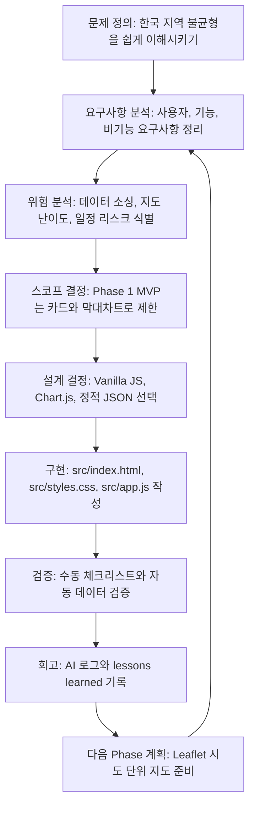
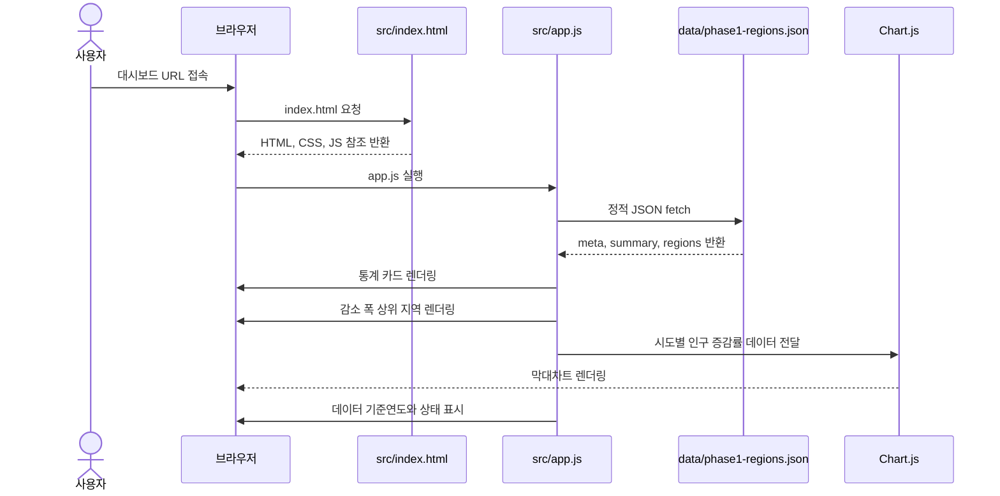
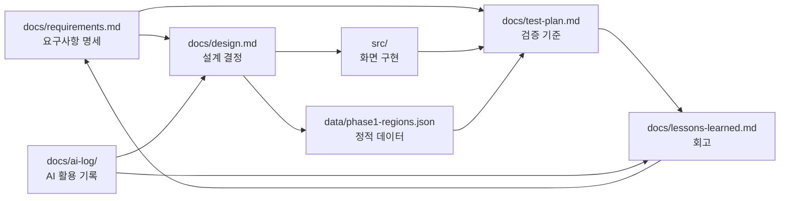

# 소프트웨어공학 프로세스 적용 기록

본 문서는 Korea Regional Imbalance Dashboard에 적용한 소프트웨어공학 방법론,
개발 프로세스, 산출물, 검증 흐름을 한 번에 설명하기 위한 제출용 요약 문서다.

---

## 1. 적용 방법론

본 프로젝트는 단일 방법론을 기계적으로 적용하기보다, 과제 규모와 데이터 시각화
리스크에 맞춰 다음 요소를 조합했다.

| 요소 | 적용 내용 | 적용 이유 |
|---|---|---|
| 반복·점진 개발 | Phase 1, Phase 2, Phase 3으로 나누어 기능을 누적한다. | 짧은 기간 안에 제출 가능한 결과물을 먼저 확보하기 위해 |
| MVP 우선 개발 | 카드와 막대차트를 Phase 1 MVP로 고정한다. | 지도와 데이터 소싱 리스크가 막혀도 최소 결과물을 보장하기 위해 |
| 위험 기반 스코프 관리 | 시군구 지도, 폐교 위치 레이어, 실시간 API는 후순위로 미룬다. | 일정 초과 가능성이 높은 기능을 통제하기 위해 |
| V-Model식 추적성 | 요구사항, 설계, 구현, 테스트 항목을 서로 연결한다. | "무엇을 왜 만들었고 어떻게 검증했는지"를 설명하기 위해 |
| ADR 기반 의사결정 | 주요 설계 결정은 `docs/design.md`에 기록한다. | AI 제안과 개발자 판단의 근거를 남기기 위해 |
| 회고 기반 개선 | `docs/lessons-learned.md`와 `docs/ai-log/`에 교훈을 누적한다. | 바이브코딩 과정 자체를 분석 대상으로 만들기 위해 |

요약하면, 본 프로젝트의 방법론은 **위험 기반 반복·점진 개발**이다.
각 Phase는 작은 폭포수처럼 `요구사항 -> 설계 -> 구현 -> 검증 -> 회고`를 거치고,
다음 Phase에서 개선 사항을 반영한다.

---

## 2. 전체 개발 프로세스



이 흐름에서 중요한 점은 구현이 먼저가 아니라, 요구사항과 리스크 판단이 먼저라는 점이다.
AI가 제안한 기능이라도 Phase 범위와 위험도를 검토한 뒤 수용 여부를 결정한다.

---

## 3. 화면 렌더링 시퀀스



Phase 1은 서버 애플리케이션 없이 정적 파일만으로 동작한다.
따라서 데이터 요청 실패, JSON 구조 오류, CDN 로딩 실패가 주요 검증 대상이다.

---

## 4. 산출물 연결 구조



이 연결 구조를 통해 보고서에서는 다음 논리를 만들 수 있다.

1. 요구사항을 먼저 정의했다.
2. 설계 결정은 요구사항과 리스크에 근거했다.
3. 구현 파일은 요구사항 ID와 연결된다.
4. 테스트 계획은 요구사항 충족 여부를 확인한다.
5. 회고 문서는 다음 Phase의 개선점으로 되돌아간다.

---

## 5. 요구사항 공학 적용 방식

| 단계 | 본 프로젝트 적용 |
|---|---|
| 이해관계자 식별 | 일반 사용자, 과제 평가자, 프로젝트 리뷰어 |
| 사용자 목표 정의 | 핵심 수치 파악, 지역별 차이 비교, AI 활용 프로세스 확인 |
| 기능 요구사항 정의 | 카드, 막대차트, 수도권 구분, 데이터 기준 표시, 정적 JSON 로드 |
| 비기능 요구사항 정의 | 정적 호스팅, 반응형 레이아웃, 재현성, 유지보수성, 접근성 |
| 범위 통제 | 지도와 실시간 API는 Phase 1에서 제외 |
| 추적성 관리 | 요구사항 ID를 데이터, 화면 코드, 테스트 계획에 연결 |
| 변경 관리 | 새 기능은 요구사항과 설계 기록을 먼저 갱신한 뒤 구현 |

요구사항 상세는 `docs/requirements.md`에 기록한다.

---

## 6. 검증 및 품질 보증 전략

Phase 1 검증은 자동 검증과 수동 검증을 함께 사용한다.

| 검증 방식 | 확인 항목 | 관련 산출물 |
|---|---|---|
| JavaScript 문법 검사 | `src/app.js` 문법 오류 여부 | `src/app.js` |
| JSON 구조 검사 | 필수 meta, summary, regions 존재 여부 | `data/phase1-regions.json` |
| 정적 서버 실행 | `fetch` 경로와 정적 호스팅 가능성 | `README.md`, `src/index.html` |
| 브라우저 수동 확인 | 카드, 차트, 반응형 레이아웃, 콘솔 오류 | `docs/test-plan.md` |
| 문서 정합성 확인 | README, 요구사항, 설계, 테스트 계획의 일치 여부 | `docs/` |

현재 자동 검증 명령은 다음과 같다.

```bash
node --check src/app.js
node tests/verify-data.mjs
```

---

## 7. 리스크 관리

| 리스크 | 영향 | 대응 |
|---|---|---|
| 공식 통계 확보 지연 | 데이터 신뢰도 저하 | Phase 1은 임시 데이터로 화면 구조를 검증하고, 공식 데이터 교체를 별도 작업으로 관리 |
| 지도 구현 난이도 | 일정 초과 | Phase 2에서 시도 단위 choropleth로 범위 제한 |
| 폐교 위치 좌표 변환 | 전처리 부담 증가 | 지도 레이어가 아니라 카드와 차트 중심으로 표현 |
| 외부 CDN 장애 | 차트 미렌더링 | Chart.js 의존성을 문서화하고 제출 전 캡처 확보 |
| AI의 과도한 기능 제안 | 스코프 크리프 | AI 제안은 요구사항, 리스크, Phase 범위 기준으로 검토 후 수용 |
| 문서와 구현 불일치 | 보고서 신뢰도 저하 | 오늘 작업 로그, 테스트 계획, README를 함께 갱신 |

---

## 8. 형상 관리와 커밋 전략

- 모든 변경은 Git 커밋으로 남긴다.
- 커밋 메시지는 Conventional Commits 형식을 사용한다.
- 기능 구현뿐 아니라 요구사항, 설계, 테스트, 회고 문서 변경도 커밋 대상이다.
- 날짜별 AI 활용 기록을 `docs/ai-log/`에 남겨 개발 과정의 재현성을 확보한다.

예시:

```text
docs: 소프트웨어공학 프로세스 문서화
feat: Phase 2 지도 초안 추가
test: 데이터 구조 검증 스크립트 추가
```

---

## 9. 2026-05-25 현재 상태

| 항목 | 상태 |
|---|---|
| Phase 1 MVP 화면 | 구현 완료 |
| Phase 1 요구사항 문서 | 작성 완료 |
| 설계 결정 기록 | 작성 완료 |
| 테스트 계획 | 작성 완료, 자동 검증 보강 |
| 데이터 | 임시 시연 데이터, 공식 데이터 교체 필요 |
| Phase 2 지도 | Leaflet 지도, 지표 전환, 지역 선택, 위험지수 진단, 시나리오 전환 구현 |
| 오늘 커밋 목표 | 위험지수 시나리오 비교 기능 보강 |

다음 단계는 공식 데이터 교체와 위험지수 산식 재보정이다.
