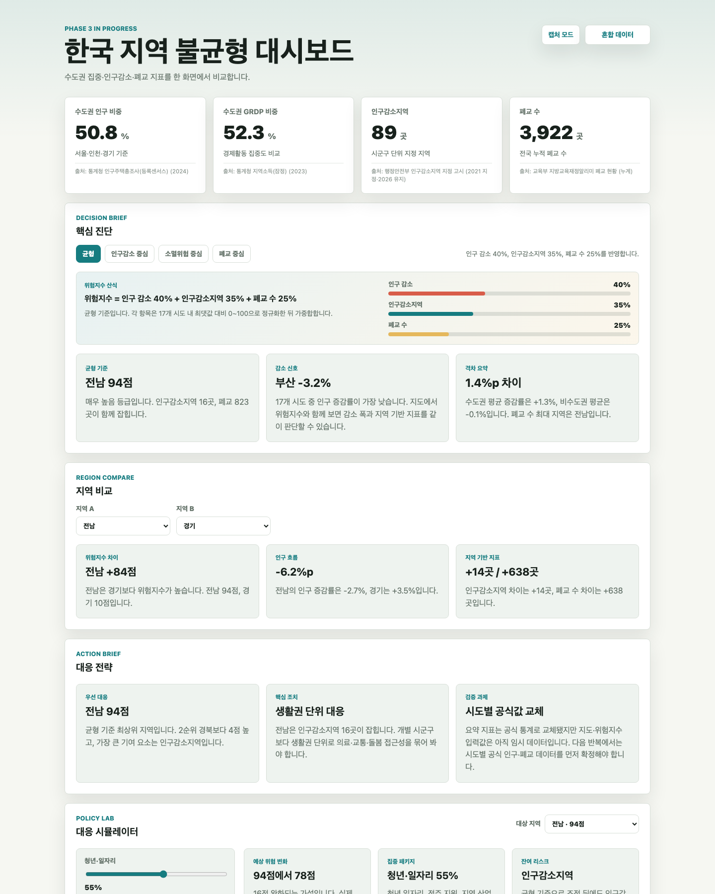
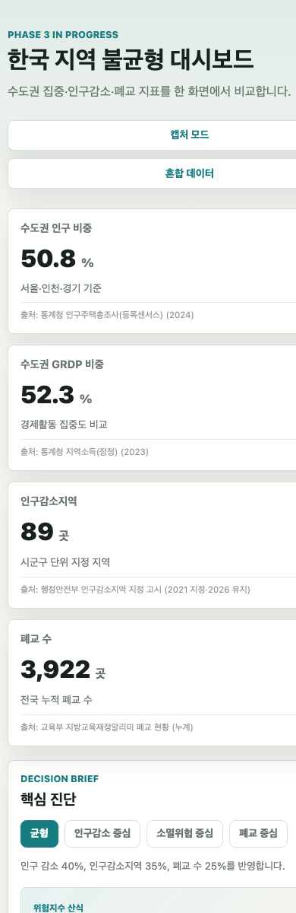

# 제출 증빙 인덱스

본 문서는 소프트웨어공학 과제 제출 요구사항과 저장소 산출물을 직접 연결하기 위한
체크리스트다. 평가자가 README만 보고도 프로세스 적용 증빙을 따라갈 수 있도록 정리한다.

---

## 1. 과제 요구사항 대응표

| 과제 요구사항 | 저장소 증빙 | 현재 상태 |
|---|---|---|
| 바이브코딩으로 만들 SW 선정 | `README.md`, `docs/design.md` | 한국 지역 불균형 대시보드로 확정 |
| 바이브코딩 AI 자율 선정 | `README.md`, `docs/design.md`, `docs/ai-log/` | Claude와 Codex 역할 분담 기록 |
| 요구사항 분석 | `docs/requirements.md` | 기능 요구사항, 비기능 요구사항, 유스케이스 작성 |
| 설계 및 방법론 | `docs/process.md`, `docs/design.md` | 위험 기반 반복·점진 개발, V-Model식 추적성, ADR 적용 |
| 구현 산출물 | `src/index.html`, `src/styles.css`, `src/app.js`, `data/` | 정적 웹 대시보드 구현 |
| 품질 관리 | `docs/test-plan.md`, `tests/`, `.github/workflows/ci.yml` | 로컬 `npm test`, 제출물 검증, GitHub Actions 검증 |
| 프로세스 적용 교훈 | `docs/lessons-learned.md`, `docs/final-report-draft.md` | 날짜별 lessons learned 누적 |
| 사용자 피드백 반영 | `docs/ai-log/2026-06-02-policy-simulator.md`, `docs/requirements.md` | "단순 표시 앱" 피드백을 정책 대응 시뮬레이터 요구사항으로 전환 |
| SW 산출물 캡처 | `docs/assets/screenshots/2026-06-02-dashboard-capture.png`, `docs/assets/screenshots/2026-06-02-dashboard-mobile.png` | 2026-06-02 데스크톱·모바일 캡처 확보 |
| PDF 제출 보고서 | `docs/final-report.html`, `docs/final-report.pdf` | 최종 보고서 HTML/PDF 작성 |
| 제출 직전 확인 | `docs/final-submission-checklist.md` | 제출 파일, 검증 명령, 잔여 작업 정리 |
| 형상 관리 시스템 공유 | GitHub repository | main 브랜치에 산출물과 증빙 문서 누적 |
| 착수 시점 토의 증빙 | `docs/ai-log/2026-05-18-kickoff.md`, `docs/ai-log/2026-05-18-codex-review.md` | 주제 선정과 AI 교차 검토 기록 |
| 지속적 토의 증빙 | `docs/ai-log/` 날짜별 로그, Git commit history | 5/18부터 6/2까지 주기적 진행 기록 |

---

## 2. 지속 진행 타임라인

| 날짜 | 주요 활동 | 증빙 |
|---|---|---|
| 2026-05-18 | 주제 선정, AI 역할 분담, 초기 설계 토의 | `docs/ai-log/2026-05-18-kickoff.md` |
| 2026-05-21 | Phase 1 요구사항, 데이터 초안, MVP 구현 | `docs/ai-log/2026-05-21-phase1-mvp.md` |
| 2026-05-25 | 프로세스 문서화, 지도 초안, 위험지수 도입 | `docs/process.md`, `docs/ai-log/2026-05-25-process-hardening.md` |
| 2026-05-26 | 위험지수 시나리오와 두 지역 비교 기능 추가 | `docs/ai-log/2026-05-26-risk-scenarios.md` |
| 2026-05-27 | 위험지수 산식 설명과 가중치 UI 추가 | `docs/ai-log/2026-05-27-risk-formula.md` |
| 2026-05-29 | 요약 지표 공식 통계 교체와 출처 표기 | `docs/ai-log/2026-05-29-official-summary-data.md` |
| 2026-05-31 | 지역 탐색, 대응 전략, 폐교 분석, UI 계약 검증 | `docs/ai-log/2026-05-31-region-exploration.md` |
| 2026-06-01 | 보고서 요약, CI, Pages, 캡처 모드 추가 | `docs/ai-log/2026-06-01-report-prep.md` |
| 2026-06-02 | 제출 증빙 인덱스와 화면 캡처 확보 | `docs/ai-log/2026-06-02-submission-evidence.md` |
| 2026-06-02 | 정책 대응 시뮬레이터 추가와 요구사항 추적성 갱신 | `docs/ai-log/2026-06-02-policy-simulator.md` |
| 2026-06-03 | GitHub Pages 배포 실패 원인 분석과 워크플로 수정 | `docs/ai-log/2026-06-03-pages-finalization.md` |

위 흐름은 막판에 한 번에 구현한 것이 아니라, 요구사항과 검증 기준을 기능 확장과 함께
반복적으로 갱신했음을 보여준다.

---

## 3. 화면 캡처

아래 이미지는 2026-06-02 기준 대시보드 실행 결과를 headless Chrome으로 캡처한 것이다.

모바일 폭에서도 주요 정보가 세로 흐름으로 표시되는지 확인하기 위해 별도 캡처를 남겼다.

---

## 4. 제출 전 남은 항목

| 항목 | 이유 | 권장 처리 |
|---|---|---|
| 공식 시도별 데이터 보강 | 데이터 신뢰도 향상 | 임시 시도별 분석값을 공식 기준으로 단계적 교체 |
| 최종 검증 로그 | 제출 직전 재현성 확보 | `npm test` 결과와 브라우저 캡처 결과를 `docs/test-plan.md`에 추가 |
